# Communication-Project

### General Instructions in all schemas:
##### Random Integer Generator
* Initial seed = 37
* Sample time = 0.1s
* Samples per frame = 100
#### AWGN Channel
* Initial seed = 67
* Number of bits per symbol = 1
* Input signal power = 1
* Symbol period = 1s
* Simulation time = 1000s
#### BER diagrams are set [-10, 10] dB
------------------------------------------------------------------
## Binary Phase Shift Keying Modulation
#### BPSK (also sometimes called PRK, phase reversal keying, or 2PSK) is the simplest form of phase shift keying (PSK). It uses two phases which are separated by 180° and so can also be termed 2-PSK.
### The modulation Schema contains: 
1.	The Random Integer Generator block, block generates uniformly distributed random integers in the range [0, M-1], where M is specified by the Set size parameter
2.	The BPSK Modulator Baseband block, to the right of the Integer Random Generator block, modulates the signal.
3. The Constellation Diagram block, displays a scatter plot of the signal without the added noise.
4.	The AWGN Channel block models a noisy channel by adding white Gaussian noise to the modulated signal.
5.	The Constellation Diagram block, displays a scatter plot of the signal with added noise.
6.	The BPSK Demodulator Baseband block Baseband block, to the right of the AGWN channel demodulates the signal.
7.	The Error Rate Calculation block counts symbols that differ between the received signal and the transmitted signal.
8.	The To Workspace block, labeled Ber outputs the results to the workspace to use when plotting results.
## The Schema
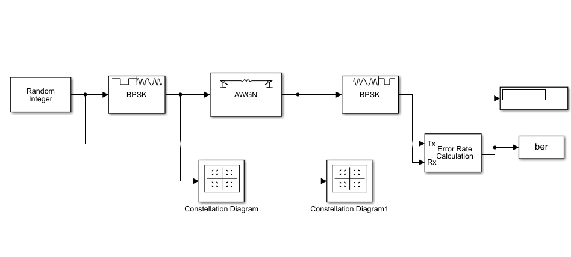
## Instruction SET:
* Random Generator set size = 2
## Scatter Plot:
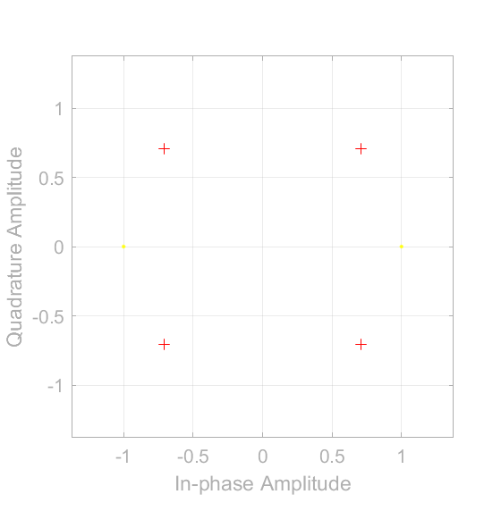

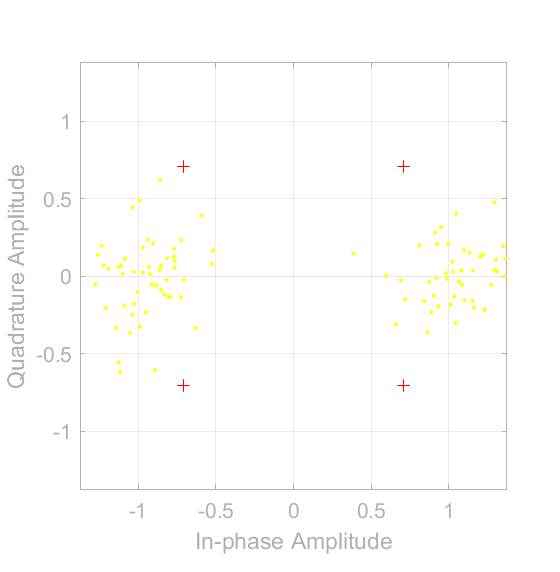

## BER performance figure:
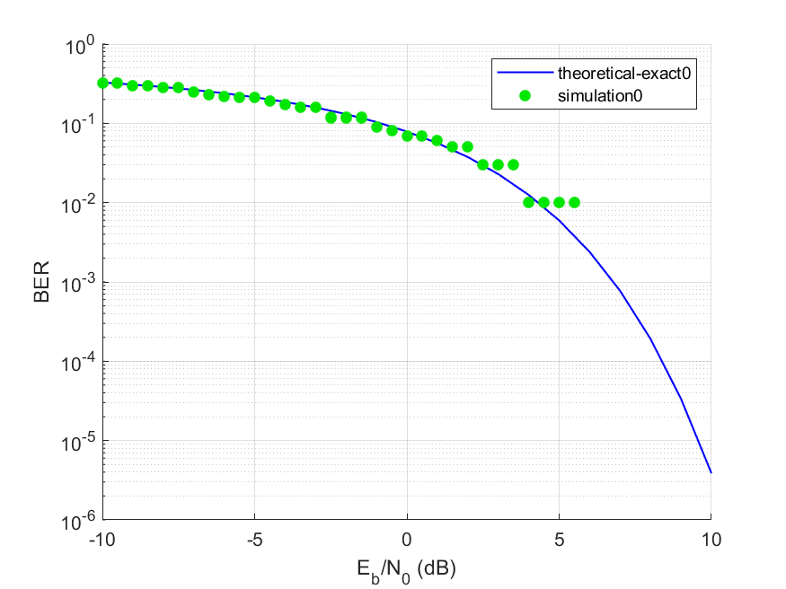

------------------------------------------------------
## Quadrature Phase Shift keying Modulation
#### Quadrature phase shift keying (QPSK) is another modulation technique, and it’s a particularly interesting one because it actually transmits two bits per symbol. In other words, a QPSK symbol doesn’t represent 0 or 1—it represents 00, 01, 10, or 11.In this technique the sine wave carrier takes four phase reversals such as 0°, 90°, 180°, and 270°.
### The modulation Schema contains: 
1.	The Random Integer Generator block, block generates uniformly distributed random integers in the range [0, M-1], where M is specified by the Set size parameter
2.	The QPSK Modulator Baseband block, to the right of the Integer Random Generator block, modulates the signal.
3. The Constellation Diagram block, displays a scatter plot of the signal without the added noise.
4.	The AWGN Channel block models a noisy channel by adding white Gaussian noise to the modulated signal.
5.	The Constellation Diagram block, displays a scatter plot of the signal with added noise.
6.	The QBSK Demodulator Baseband block Baseband block, to the right of the AGWN channel demodulates the signal.
7.	The Error Rate Calculation block counts symbols that differ between the received signal and the transmitted signal.
8.	The To Workspace block, labeled Ber outputs the results to the workspace to use when plotting results.
## The Schema
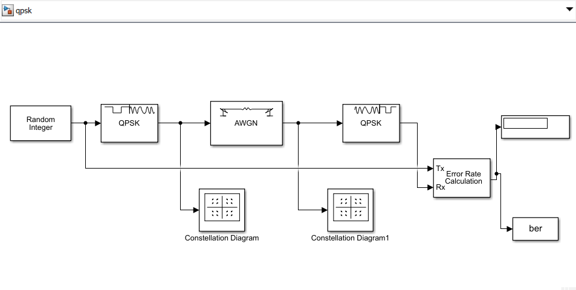
## Instruction SET:
* Random Integer Generator set size = 4
## Scatter Plot:
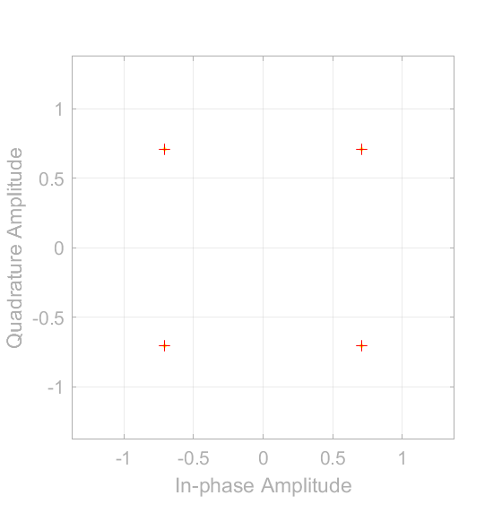

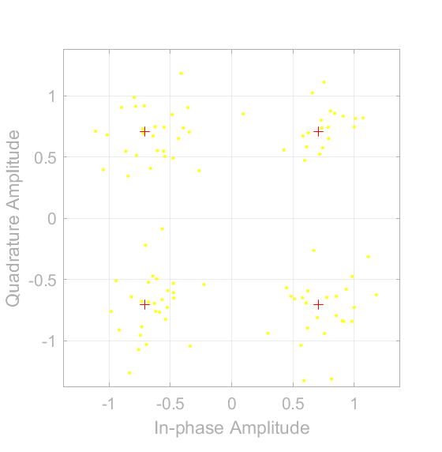

## BER performance figure:
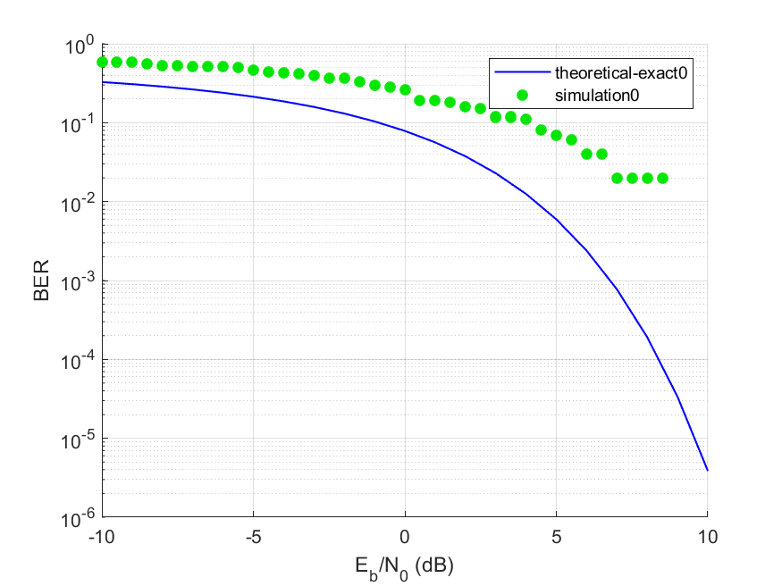
------------------------------------------------------
## Frequency Shift Keying Modulation
#### Frequency-shift keying (FSK) is the frequency modulation system in which digital information is transmitted through the discrete frequency change of a carrier wave.
### The modulation Schema contains: 
1.	The Random Integer Generator block, block generates uniformly distributed random integers in the range [0, M-1], where M is specified by the Set size parameter
2.	The FSK Modulator Baseband block, to the right of the Integer Random Generator block, modulates the signal.
3. The Constellation Diagram block, displays a scatter plot of the signal without the added noise.
4.	The AWGN Channel block models a noisy channel by adding white Gaussian noise to the modulated signal.
5.	The Constellation Diagram block, displays a scatter plot of the signal with added noise.
6.	The FSK Demodulator Baseband block, to the right of the AGWN channel demodulates the signal.
7.	The Error Rate Calculation block counts symbols that differ between the received signal and the transmitted signal.
8.	The To Workspace block, labeled Ber outputs the results to the workspace to use when plotting results.
## The Schema
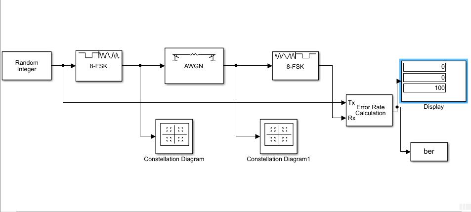
## Instruction SET:
* Random Integer Generator set size = 8
## Scatter Plot:

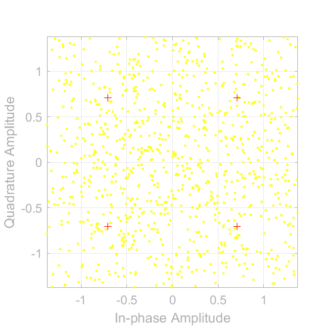

## BER performance figure:
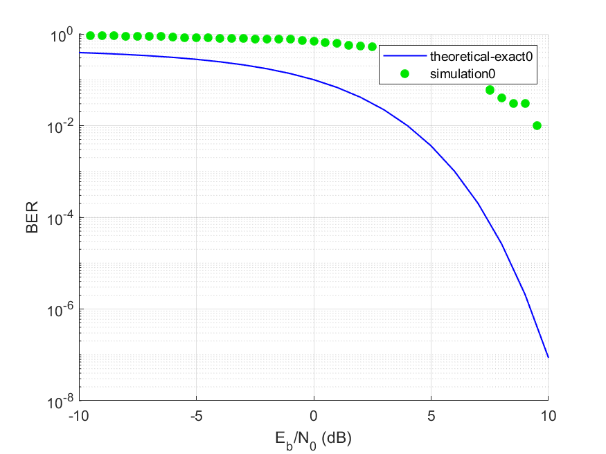

------------------------------------------------------

## 16-Quadrature Amplitude Modulation
#### Quadrature amplitude modulation (QAM) is a modulation scheme used for both digital and analog signals. QAM doubles the effective bandwidth by combining two amplitude-modulated signals into a single channel. This allows multiple analog signals to be placed on a single carrier,

1.	The Random Integer Generator block, block generates uniformly distributed random integers in the range [0, M-1], where M is specified by the Set size parameter
2.	The Rectangular QAM Modulator Baseband block, to the right of the Integer Random Generator block, modulates the signal using baseband 16 QAM.
3. The Constellation Diagram block, displays a scatter plot of the signal without the added noise.
4.	The AWGN Channel block models a noisy channel by adding white Gaussian noise to the modulated signal.
5.	The Constellation Diagram block, displays a scatter plot of the signal with added noise.
6.	The Rectangular QAM Demodulator Baseband block, to the right of the AGWN channel demodulates the signal.
7.	The Error Rate Calculation block counts symbols that differ between the received signal and the transmitted signal.
8.	The To Workspace block, labeled Ber outputs the results to the workspace to use when plotting results.
## The Schema

## Instruction SET:
* Random Integer Generator set size = 16

* Modulator and demodulation: Normalization method = Average power
## Scatter Plot:

## BER performance figure:

-----------------------------------------------------------
## 64-Quadrature Amplitude Modulation
#### Quadrature amplitude modulation (QAM) is a modulation scheme used for both digital and analog signals. QAM doubles the effective bandwidth by combining two amplitude-modulated signals into a single channel. This allows multiple analog signals to be placed on a single carrier,

1.	The Random Integer Generator block, block generates uniformly distributed random integers in the range [0, M-1], where M is specified by the Set size parameter
2.	The Rectangular QAM Modulator Baseband block, to the right of the Integer Random Generator block, modulates the signal using baseband 64 QAM.
3. The Constellation Diagram block, displays a scatter plot of the signal without the added noise.
4.	The AWGN Channel block models a noisy channel by adding white Gaussian noise to the modulated signal.
5.	The Constellation Diagram block, displays a scatter plot of the signal with added noise.
6.	The Rectangular QAM Demodulator Baseband block, to the right of the AGWN channel demodulates the signal.
7.	The Error Rate Calculation block counts symbols that differ between the received signal and the transmitted signal.
8.	The To Workspace block, labeled Ber outputs the results to the workspace to use when plotting results.
## The Schema

## Instruction SET:
* Random Integer Generator set size = 64

* Modulator and demodulation

Normalization method = Average power
## Scatter Plot:

## BER performance figure:

-----------------------------------------------------------------------

## After adding raised cosine 
#### The Raised Cosine Transmit Filter and Raised Cosine Receive Filter blocks are designed for raised cosine filtering. Each block can apply a square-root raised cosine filter or a normal raised cosine filter to a signal. You can vary the rolloff factor and span of the filter.
#### The Raised Cosine Transmit Filter and Raised Cosine Receive Filter blocks are tailored for use at the transmitter and receiver, respectively. The transmit filter outputs an upsampled (interpolated) signal, while the receive filter expects its input signal to be upsampled. The receive filter lets you choose whether to have the block downsample (decimate) the filtered signal before sending it to the output port.
#### Both raised cosine filter blocks introduce a propagation delay.
--------------------------------------------------------------
## The Schema

## The Change in the instruction Set for Binary Phase Shift Keying Modulation :
*
*
*
*
*

## Scatter Plot for Binary Phase Shift Keying Modulation:

## BER performance figure for Binary Phase Shift Keying Modulation:
----------------------------------------------------------------------

## The Schema
## The Change in the instruction Set for Quadrature Shift Keying Modulation :
*
*
*
*
*
## Scatter Plot Set for Quadrature Shift Keying Modulation:
## BER performance figure Set for Quadrature Shift Keying Modulation:
---------------------------------------------------------------
## The Change in the instruction Set for Frequency Shift Keying Modulation :
*
*
*
*
*
## Scatter Plot for Frequency Shift Keying Modulation:
## BER performance figure for Frequency Shift Keying Modulation:

---------------------------------------------------------------
## The Change in the instruction Set for 16-Quadrature Amplitude Modulation :
*
*
*
*
* 

## Scatter Plot  for 16-Quadrature Amplitude Modulation:

## BER performance figure  for 16-Quadrature Amplitude Modulation:
---------------------------------------------------------------
## The Schema
## The Change in the instruction Set for 64-Quadrature Amplitude Modulation :
*
*
*
*
* 

## Scatter Plot  for 64-Quadrature Amplitude Modulation:
## BER performance figure  for 64-Quadrature Amplitude Modulation:
